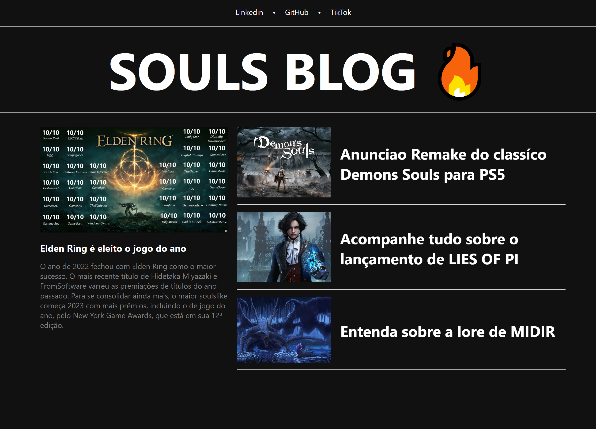
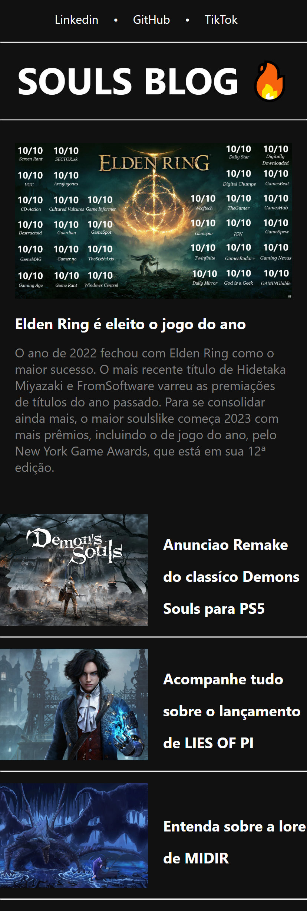

<h1 align="center"> Souls Blog </h1>

 

<h1 align="center">Versão Desktop</h1>

  

 
<h1 align="center">Versão Mobile</h1>

  

## 🚀 Tecnologias

Esse projeto foi desenvolvido com as seguintes tecnologias:

- HTML e CSS
- JavaScript / Typescript
- Angular
- Node
- Git e Github

## 💻 Projeto

O Souls Blog é um site para te atualizar sobre tudo que envolve a trilogia Souls, desde os lançamentos até dicas para melhorar sua gameplay

## :memo: Licença
